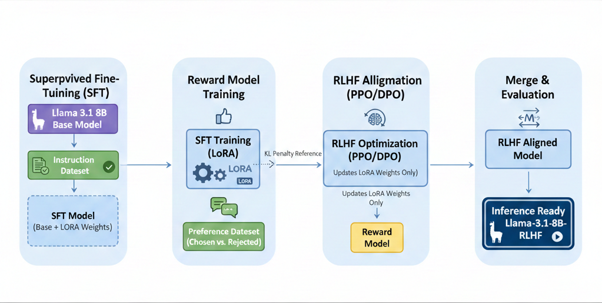

# Alpaca-LoRA-RLHF-PyTorch
Full pipeline to finetune Alpaca LLM with LoRA and RLHF on consumer hardware.

## Theory
- Base model: The pretrained foundation model (e.g., Llama 3.1 8B) used as the starting point for all downstream steps.
- SFT (Supervised Fine-Tuning): Trains LoRA adapters on instruction data so the model follows prompts and produces task-specific responses.
- Reward model (RM): A separate model trained on preference pairs that learns to score responses for a given prompt.
- Reward model output: A scalar score per response (higher is better) used as the optimization signal for RLHF.
- PPO-based RLHF: Uses Proximal Policy Optimization to update the SFT model so its outputs receive higher reward scores while staying close to the original policy.
- LoRA adapters: Lightweight, trainable layers injected into the base model to reduce VRAM use and enable fast fine-tuning.
- Adapter merge: Combines LoRA weights into the base model to produce a standalone checkpoint for inference or the next stage.

## About
- Trains a LLaMA-style causal language model with LoRA adapters on Alpaca-style instruction data.
- Trains a reward model on pairwise preferences.
- Runs PPO-based RLHF to align responses using the reward model.
- Goal: produce an instruction-following assistant with improved response quality on consumer hardware.



### Default Model & Datasets (Examples)
- Base model: `meta-llama/Llama-3.1-8B` for SFT and reward modeling; PPO uses the merged SFT checkpoint plus the merged reward model.
  - Link: <https://huggingface.co/meta-llama/Llama-3.1-8B>
- Datasets:
  - SFT: `yahma/alpaca-cleaned` (instruction-following pairs).
    - Link: <https://huggingface.co/datasets/yahma/alpaca-cleaned>
  - Reward modeling + PPO prompts: `./datasets/` (pairwise preference data with `user_input`, `completion_a`, `completion_b`).
- Trained/tested on: RTX 4090 GPU.

## Example Output (Illustrative)
Instruction:
"Give three tips for staying healthy."

- Base model output (typical):
  "Staying healthy is important. There are many ways to do this. It depends on your lifestyle and goals."
- After SFT (typical):
  "Here are three tips: 1) Eat a balanced diet with fruits and vegetables. 2) Exercise regularly. 3) Get enough sleep."
- After RLHF using the reward model (typical):
  "1) Eat a balanced diet with plenty of fruits and vegetables. 2) Exercise regularly to keep your body strong. 3) Get 7-9 hours of sleep each night."

---

## Installation (Conda)
```bash
conda create -n alpaca-lora-rlhf python=3.10 -y
conda activate alpaca-lora-rlhf
pip install -r requirements.txt
```

## Local patches (non-repo files)
These are diffs for changes made in site-packages to get PPO running in this environment. They add compatibility shims for TRL/Transformers API changes and fix 8-bit + PEFT edge cases during PPO setup.
- `external_patches/trl-core.patch`
- `external_patches/trl-modeling_base.patch`
- `external_patches/transformers-modeling_utils.patch`
- Apply them (from repo root):
```bash
SITE_PACKAGES=$(python -c "import site; print(site.getsitepackages()[0])")
patch -p0 -d "$SITE_PACKAGES" < external_patches/trl-core.patch
patch -p0 -d "$SITE_PACKAGES" < external_patches/trl-modeling_base.patch
patch -p0 -d "$SITE_PACKAGES" < external_patches/transformers-modeling_utils.patch
```

## Hugging Face Auth (for gated models)
```bash
hf auth login
```
If you are using a gated model (e.g., LLaMA weights), make sure your Hugging Face account has access to the repo.

---

## 5-Step Training + Merge Workflow
1. Supervised finetune (SFT)
   - Train a LoRA adapter on Alpaca-style data.
   - Command:
    ```bash
    python train/supervised_finetune.py --base_model 'meta-llama/Llama-3.1-8B' --data_path 'yahma/alpaca-cleaned' --output_dir './output/lora-alpaca' --num_epochs 1
    ```
   - Note: 8-bit with CPU offload is the default. To disable CPU offload, pass `--allow_cpu_offload False`. FP16 typically needs ~24–32GB VRAM for 8B models.

2. Merge the SFT adapter into the base model
   - Produce a merged checkpoint for downstream training.
   - Command:
    ```bash
    python train/merge_peft_adapter.py --model_name ./output/lora-alpaca
    ```
   - Output: `./output/lora-alpaca-adapter-merged`

3. Train reward model (RM)
   - Fit a reward model for PPO.
   - Command:
    ```bash
    python train/train_reward_model.py --model_name 'meta-llama/Llama-3.1-8B' --gradient_accumulation_steps 32 --per_device_train_batch_size 1 --train_subset 100 --eval_subset 10 --local_rank 0 --bf16 False
    ```
   - Output: `./output/reward_model_Llama-3.1-8B_100_2e-05`

4. Merge the RM adapter into the base model
   - Produce a merged RM checkpoint for PPO.
   - Command:
    ```bash
    python train/merge_peft_adapter.py --model_name ./output/reward_model_Llama-3.1-8B_100_2e-05
    ```
   - Output: `./output/reward_model_Llama-3.1-8B_100_2e-05-adapter-merged`

5. PPO tuning (RLHF)
   - Optimize the SFT model using the merged reward model.
   - Command:
    ```bash
    python train/tuning_lm_with_rl.py --model_name './output/lora-alpaca-adapter-merged' --reward_model_name './output/reward_model_Llama-3.1-8B_100_2e-05-adapter-merged' --adafactor False --tokenizer_name 'meta-llama/Llama-3.1-8B' --save_freq 100 --output_max_length 128 --batch_size 1 --gradient_accumulation_steps 1 --batched_gen True --ppo_epochs 1 --seed 0 --learning_rate 1.4e-5 --early_stopping True --output_dir './output/checkpoints/tuning_llama_rl/'
    ```

---

## Inference (Base vs SFT vs RLHF)
Use `inference/run_inference.py` to compare outputs across the three stages. It uses the Alpaca prompt template from `templates/alpaca.json`.

Base model (raw):
```bash
python inference/run_inference.py \
  --mode base \
  --model_name 'meta-llama/Llama-3.1-8B' \
  --tokenizer_name 'meta-llama/Llama-3.1-8B' \
  --instruction "Give three tips for staying healthy." \
  --load_in_8bit --allow_cpu_offload
```

SFT adapter (LoRA on top of base):
```bash
python inference/run_inference.py \
  --mode sft \
  --model_name 'meta-llama/Llama-3.1-8B' \
  --adapter_path './output/lora-alpaca' \
  --tokenizer_name 'meta-llama/Llama-3.1-8B' \
  --instruction "Give three tips for staying healthy." \
  --load_in_8bit --allow_cpu_offload
```

SFT merged checkpoint (optional alternative to adapter):
```bash
python inference/run_inference.py \
  --mode sft \
  --merged_model_path './output/lora-alpaca-adapter-merged' \
  --tokenizer_name 'meta-llama/Llama-3.1-8B' \
  --instruction "Give three tips for staying healthy." \
  --load_in_8bit --allow_cpu_offload
```

RLHF (PPO checkpoint):
```bash
python inference/run_inference.py \
  --mode ppo \
  --ppo_model_path './output/checkpoints/tuning_llama_rl/step_99' \
  --tokenizer_name 'meta-llama/Llama-3.1-8B' \
  --instruction "Give three tips for staying healthy." \
  --load_in_8bit --allow_cpu_offload
```

Notes:
- PPO checkpoints are saved under `./output/checkpoints/tuning_llama_rl/step_<n>` when `--save_freq` is set.
- If you saved a different PPO step, point `--ppo_model_path` to that folder.
- Add an optional input with `--input "context here"` if your prompt needs extra context.
- Control generation with `--max_new_tokens`, `--temperature`, `--top_p`, and `--top_k`.

---

## YouTube Recording
https://youtu.be/wHukqwz3c-U

---
